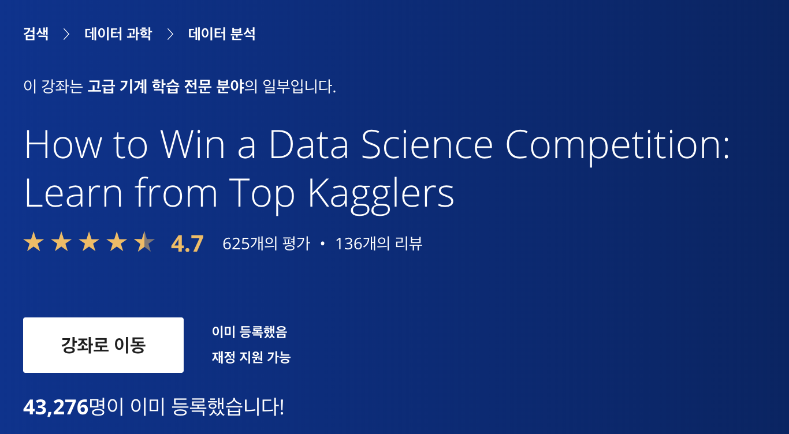
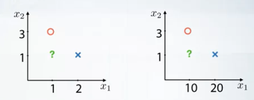
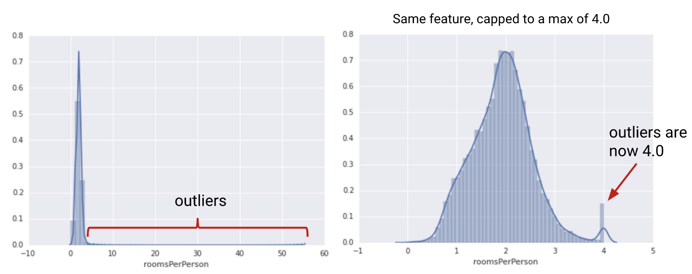

### Week1 - Feature preprocessing and generation with respect to models: Numeric Features
- Coursera "How to Win a Data Science Competition: Learn from Top Kagglers" 강의 정리.
- Kaggle 문제 해결을 통한 Data Science 능력을 키워보자.
- https://www.coursera.org/learn/competitive-data-science


### 1. Overview

#### 1.1 Feature preprocessing

- categorical 데이터를 전처리할 경우, feature 특성에 따라 방법을 달리해야 한다.


  pclass | 1 | 2 | 3
  -------|---|---|---
  target | 1 | 0 | 1


- 위 예에서 linear 모델을 쓴다면 one-hot 인코딩을 적용하는 방법이 있다.


  pclass | pclass==1 | pclass==2 | pclass==3
  -------|---|---|---
  1 | 1 |  |
  2 | | 1 |
  1 | 1 |  |
  3 | | | 1


- 즉, categorical feature에 linear 모델을 쓸 경우 -> one-hot encoding
- 단, Random Forest 모델을 쓸 경우엔 위처럼 변형할 필요 없음 (각 pclass를 각자 입력할 수 있으므로..?)

#### 1.2 Feature generation

- Feature preprossing은 때때로 필수적이다.
- Feature generation은 강력한 테크닉이다.
- preprocessing과 generation pipeline은 모델 타입에 의존적이다.


### 2. Preprocessing Numeric Features

- preprocessing은 tree-based models / non tree-based models에 따라 효과가 다르다
    - Tree-based models : scaling과 같은 전처리에 큰 영향을 받지 않는다.
    - Non Tree-based models : scaling과 같은 전처리에 크게 영향을 받는다.
- feature generation은 기존 feature 및 데이터 분석 정보를 바탕으로 새로운 feature를 만드는 것이다.

#### 2.1 Preprocessing: scaling

- scaling의 필요성
  - feature scale에 의존적인 모델과 그렇지 않은 모델이 있다.
    - feature scale : nearest neighbors, linear models, neural network

    

  - 위 이미지와 같이 feature scale이 다른 두 예에 대해 nearest neighbors 모델을 적용하면 물음표 항목 데이터의 예측값은 각각 다르게 나온다

- Linear models : 서로 다르게 scale된 feature들을 사용하기 어려움
  - 선형모델의 경우, 각 feature 계수에 동일하게 regularization을 적용해야 한다.
(regularization의 효과는 feature scale에 비례하는 것으로 알려져 있음)
  - 경사하강법(gradient descent)은 적절한 scaling이 없으면 제대로 동작하지 않는다.
  - 따라서, linear models(그리고 neural network, knn 등)에선 모든 feature들을 동일한 크기로 rescale해주는 것이 중요하다.
  - feature scaling이 다르면 모델의 품질도 달라질 수 밖에 없다.


- MinMaxScaler
  - To [0, 1]
  - X = (X - X.min()) / (X.max() - X.min())

- StandardScaler
  - To mean=0, std=1
  - X = (X - X.mean()) / X.std()

#### 2.2 Preprocessing: outliers

- outliers의 필요성
  - 대부분의 데이터와 동떨어진 일부 outlier 데이터에 의해 모델(특히 선형모델)의 예측 결과가 부정확해질 수 있다.
  - 따라서 데이터 범위의 상한과 하한을 지정하여 clip함으로써 선형모델의 성능을 높일 필요가 있다.
  - 이러한 clipping 과정은 금융 데이터 분야에선 winsorization으로 알려져 있다.

  

#### 2.3 Preprocessing: rank

- rank transformation이란?
  - 적절하게 분류된 값들에 대해 균등하게 공간을 배치하는 것.
  - rank transformation은 outlier들을 다른 값들과 가깝도록 배치하므로 MinMaxScaler보다 더 나은 효과를 낼 수도 있다.
  - example
  ```
  rank([-100, 0, 3000]) == [0, 1, 2]
  rank([10, 3, 500]) == [1, 0, 2]
  ```

  - linear models, KNN, neural network의 경우, outlier를 일일이 처리할 시간이 없을 경우 유용하게 쓸 수 있다.
  - scipy.stats.rankdata 라이브러리로 사용할 수 있다.


#### 2.4 Preprocessing: log and sqrt

- neural network에 특히 효과적인 전처리 방법으론 log와 sqrt가 있다.
- log transformation :
  - np.log(1 + x)

- sqrt :
  - extract square root from data
  - np.sqrt(x + 2/3)

- 두 가지 전처리 모두 큰 값들을 평균에 가깝게 변환시키므로 굉장히 유용함.
- 때론 서로 다른 방식으로 전처리된 dataframe을 concatenate시킨 것으로 모델을 학습시키는 것이 유용할 수 있다.
- 또는, 서로 다르게 전처리된 데이터로 학습된 모델들을 섞는 것이 효율적일 수도 있다.

### 3. Feature Generation

- feature generation은 feature와 task 관련 정보를 바탕으로 새로운 feature를 생성하는 것을 의미한다.
- feature generation에 필요한 것
  - prior knowledge
  - EDA

- 예시1
  - 부동산 매물의 "평수"와 "가격"이 주어졌다면 이 둘을 이용해 "평당 가격"이라는 새로운 feature를 생성할 수 있다.
- 예시2
  - 좌표평면 상의 두 점 사이의 vertical 길이와 horizontal 길이가 각각 주어졌다면 피타고라스의 법칙으로 두 점 사이의 직선 거리를 계산하여 새로운 feature를 생성할 수 있다.
- 예시3
  - 상품의 가격이 소숫점(\$2.99)으로 표기된다면 소숫점 부분(0.99)만 잘라 새로운 feature를 생성할 수 있다. 이 경우, financial 데이터 또는 고객의 상품 가격에 반응하는 정도와 같은 문제에서 유용할 수 있다.

### 4. Summary

1. Numeric 데이터의 전처리는 tree models / non-tree models에 따라 다르다.
  - tree models는 scaling에 영향을 받지 않는다.
  - non-tree models는 scaling에 크게 영향을 받는다. (linear, knn, neural net)
2. 가장 많이 쓰이는 preprocessing 방법
  - MinMaxScaler
  - StandardScaler
  - Clipping Outliers
  - Rank transformation (outliers 처리할 시간이 없을 때 효과적!)
  - log and sqrt (neural net에 특히 효과적!)
3. Feature Generation에 필요한 것들
  - Prior knowledge
  - EDA
