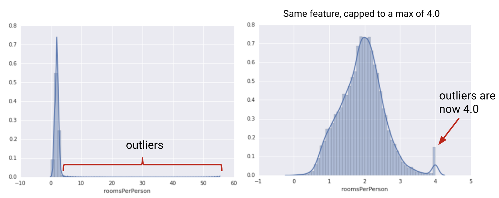

coursera "How to Win a Data Science Competition: Learn from Top Kagglers" 강의 정리.

Week1 - Feature Preprocessing and Generation with Respect to Models

### 학습 목표
- Explain how employed model impacts choice of preprocessing
- Summarize feature preprocessings for numeric and categorical features
- Summarize feature generation approaches for datetime and coordinates
- Summarize approaches to deal with missing values
- Outline the pipeline of applying Bag of Words
- Compare Bag of Words and Word2vec
- Explain how to extract CNN descriptors from images

### 1. Overview

#### 1.1 Feature preprocessing

- categorical 데이터를 전처리할 경우, feature 특성에 따라 방법을 달리해야 한다.

  pclass | 1 | 2 | 3
  -------|---|---|---
  target | 1 | 0 | 1

- 위 예에서 linear 모델을 쓴다면 one-hot 인코딩을 적용하는 방법이 있다.

  pclass | pclass==1 | pclass==2 | pclass==3
  -------|---|---|---
  1 | 1 |  |
  2 | | 1 |
  1 | 1 |  |
  3 | | | 1

- 즉, categorical feature에 linear 모델을 쓸 경우 -> one-hot encoding
- 단, Random Forest 모델을 쓸 경우엔 위처럼 변형할 필요 없음 (각 pclass를 각자 입력할 수 있으므로..?)

#### 1.2 Feature generation

- Feature preprossing은 때때로 필수적이다.
- Feature generation은 강력한 테크닉이다.
- preprocessing과 generation pipeline은 모델 타입에 의존적이다.

### 2. Numeric Features

#### 2.1 Numeric

- preprocessing
    - Tree-based models
    - Non Tree-based models
- feature generation    

#### 2.2 Preprocessing: scaling

- scaling의 필요성
  - feature scale에 의존적인 모델과 그렇지 않은 모델이 있다.
    - feature sacle : nearest neighbors, linear models, neural network

    

  - 위 이미지와 같이 feature scale이 다른 두 예에 대해 nearest neighbors 모델을 적용하면 물음표 항목 데이터의 예측값은 각각 다르게 나온다

- Linear models : 서로 다르게 scale된 feature들을 사용하기 어려움
  - 선형모델의 경우, 각 feature 계수에 동일하게 regularization을 적용해야 한다.
(regularization의 효과는 feature scale에 비례하는 것으로 알려져 있음)
  - 경사하강법(gradient descent)은 적절한 scaling이 없으면 제대로 동작하지 않는다.
  - 따라서, linear models(그리고 neural network, knn 등)에선 모든 feature들을 동일한 크기로 rescale해주는 것이 중요하다.
  - feature scaling이 다르면 모델의 품질도 달라질 수 밖에 없다.

- MinMaxScaler
  - To [0, 1]
  - X = (X - X.min()) / (X.max() - X.min())

- StandardScaler
  - To mean=0, std=1
  - X = (X - X.mean()) / X.std()

#### 2.3 Preprocessing: outliers

- outliers의 필요성
  - 대부분의 데이터와 동떨어진 일부 outlier 데이터에 의해 모델(특히 선형모델)의 예측 결과가 부정확해질 수 있다.
  - 따라서 데이터 범위의 상한과 하한을 지정하여 clip함으로써 선형모델의 성능을 높일 필요가 있다.
  - 이러한 clipping 과정은 금융 데이터 분야에선 winsorization으로 알려져 있다.

  

#### 2.4 Preprocessing: rank

- rank란?
  - 적절하게 분류된 값들에 대해 균등하게 공간을 배치하는 것.
  - rank transformation은 outlier들을 다른 값들과 가깝도록 배치하므로 MinMaxScaler보다 더 나은 효과를 낼 수도 있다.

- Example

    rank([-100, 0, 3000]) == [0, 1, 2]
    rank([10, 3, 500]) == [1, 0, 2]
