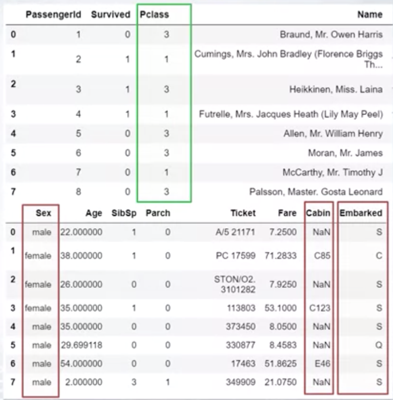
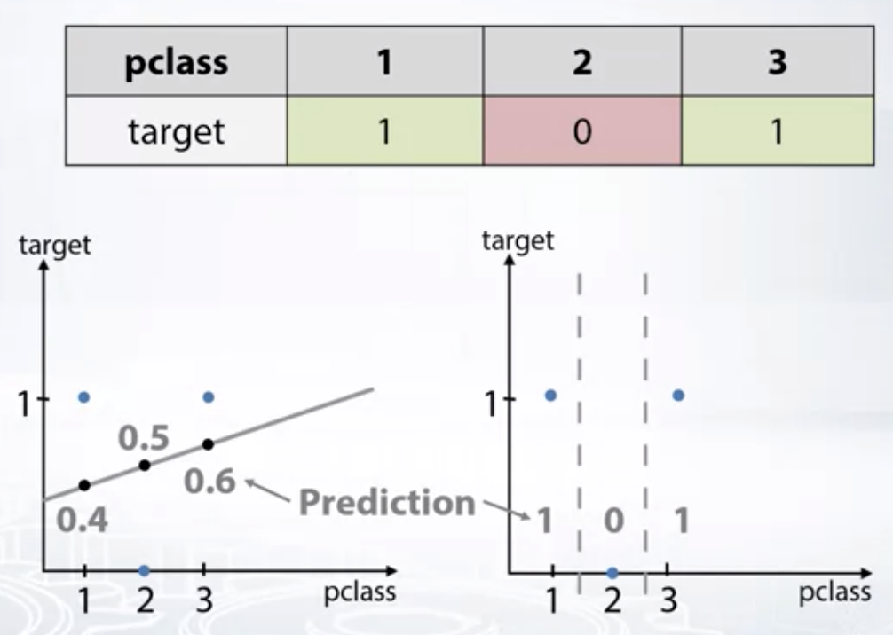
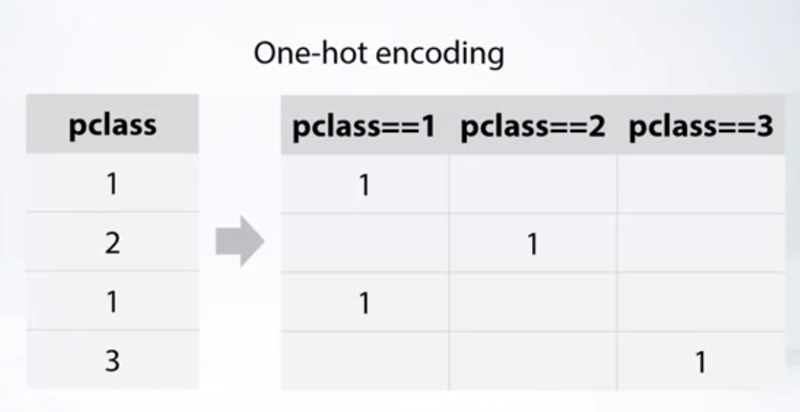
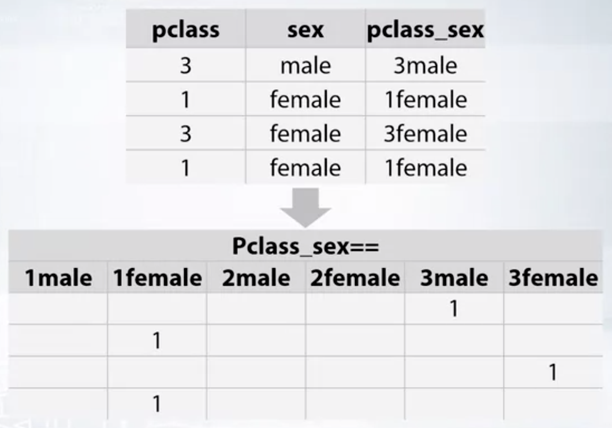

### Week1 - Feature preprocessing and generation with respect to models: Categorical and Ordinal Features
- Coursera "How to Win a Data Science Competition: Learn from Top Kagglers" 강의 정리.
- Kaggle 문제 해결을 통한 Data Science 능력을 키워보자.
- https://www.coursera.org/learn/competitive-data-science


### 1. Overview

- 모델의 타입에 따라 어떤 전처리를 적용할 것인지를 알아보자
- categorical feature와 ordinal feature의 차이점을 알아보자
- 위 두 종류의 feature를 이용하여 새로운 feature를 생성하는법을 알아보자

### 2. Categorical Features

- 타이타닉 예제의 데이터 중 categorical에 해당하는 feature들은 아래와 같다.



- pclass, sex, cabin, embarked는 categorical feature에 해당한다.
- categorical feature를 인코딩하는 가장 간단한 방법은 고유한 숫자값으로 매핑하는 것이다. (= label encoding)


### 3. Ordinal Features

- titanic 데이터셋의 pclass 예시
  - 티켓 클래스를 의미
  - 세 가지 유니크한 값 : 1, 2, 3
  - ordinal feature이다. (= order categorical feature)
  - 각 유니크 값들은 유의미한 순서(order)를 갖는다.
    - ex. pclass가 1일 수록 티켓이 비싸거나 값이 클수록 보유한 사람도 많다거나 등
  - numeric feature가 아니므로 (1, 2) 사이의 차이와 (2, 3) 사이의 차이가 동일하다고 할 수 없으며 두 차이값 중 어느쪽이 큰지 비교할 수 없다.

- 그 밖의 예시
  - Ticket class : 1, 2, 3
  - Driver's license : A, B, C
  - Education : bachelor, master, doctoral
- ordinal feature는 각 카테고리가 복잡한 순서롤 오름차순 정렬될 수 있다.

### 4. Label Encoding

- categorical feature의 값들을 고유한 숫자값으로 매핑하는 인코딩 방식으로 가장 간단한 인코딩 방법이다.
- tree-method / non tree-method 에서의 효과 비교
  - tree-method : feature들을 분할하여 가장 유용한 feature들을 추출하므로 효과적이다.
  - non tree-method : linear models, knn, neural network 등 비 트리형 모델에선 유용하지 않다. 따라서 non tree에선 categorical feature를 다르게 처리해야 한다.

- label encoding은 <b>선형모델에 부적합</b>하다.
  
  - 왼쪽과 같이 categorical을 label encoding 처리하면 선형모델은 혼란에 빠지게 된다.
  - 반면, tree-method는 분할을 통해 각 feature 값들에 독립적으로 도달하므로 label encoding을 사용할 수 있다.

- 인코딩 순서에 따른 방법
  1. Alphabetical (sorted) : 알파벳 순서에 따라 값을 인코딩
  ```
  sklearn.preprocessing.LabelEncoder
  ```
  2. Order of Appearance : 각 값이 등장한 순서에 따라 값을 인코딩
  ```
  Pandas.factorize
  ```


### 5. Frequency Encoding

- 각 카테고리의 비율로 인코딩하는 방법
- 비율이 동일한 카테고리들이 있다면 사용하기 어려움

  ```
  [S, C, Q] -> [0.5, 0.2, 0.3]
  ```
- 각 카테고리의 빈도 비율이 target과 연관성을 가진다면 frequency encoding은 linear models와 같은 non tree-method에서도 유용하다.

### 6. One-hot Encoding

- 카테고리의 값들을 0과 1로 인코딩하는 방법.


- non tree 모델에서 categorical feature를 위해 사용할 수 있는 간단한 인코딩 방법이다.
- 반면, tree 모델에선 one-hot처리된 feature가 많을 수록 느려지고 성능도 떨어진다.
- one-hot은 이미 0과 1의 값만 가지므로 <b>이미 scale되어 있다</b>.
- 유니크한 값이 많을 때 one-hot을 적용하면 sparse한 칼럼들이 많이 추가된다.
  - sparse matrix를 사용할 때 메모리 효율을 높이려면 모든 값을 메모리에 할당하지 않고, 0이 아닌 값만 저장하면 된다.
  - sparse matrix 처리에 적합한 라이브러리 : XGBoost, LightGBM, sklearn

### 7. Feature Generation with categorical

- 몇몇 categorical feature들을 조합하여 새로운 feature를 생성할 수 있다.



- non tree 모델에서 특히 유용하다. -> linear models, knn


### 8. Summary

1. Ordinal feature의 값들은 의미있는 방식의 순서를 가진다.
2. Label encoding은 각 카테고리를 고유한 숫자로 매핑하는 방법이다.
  - tree-method에서 유용하다.
  - non tree-method에는 부적합하다.
3. Frequency encoding은 카테고리의 비율로 인코딩하는 방법이다.
  - 카테고리 비율이 target과의 연관성을 가진다면 non tree-method에서도 유용하다.
4. Label encoding과 Frequency encoding은 주로 tree-method에서 사용된다.
5. One-hot encoding은 주로 non tree-method에서 사용된다.
6. Categorical feature들을 조합하여 새로운 feature를 생성할 수 있다.
  - linear models, knn에서 특히 유용하다.
