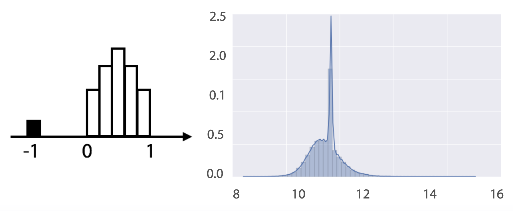
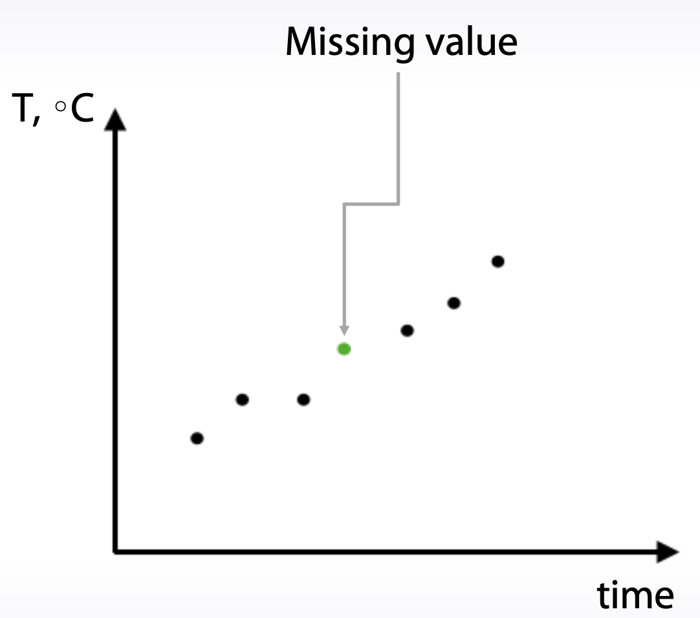
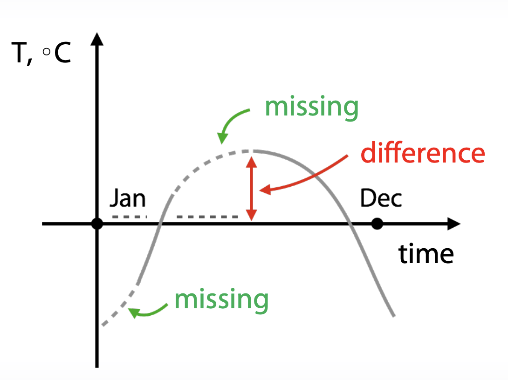
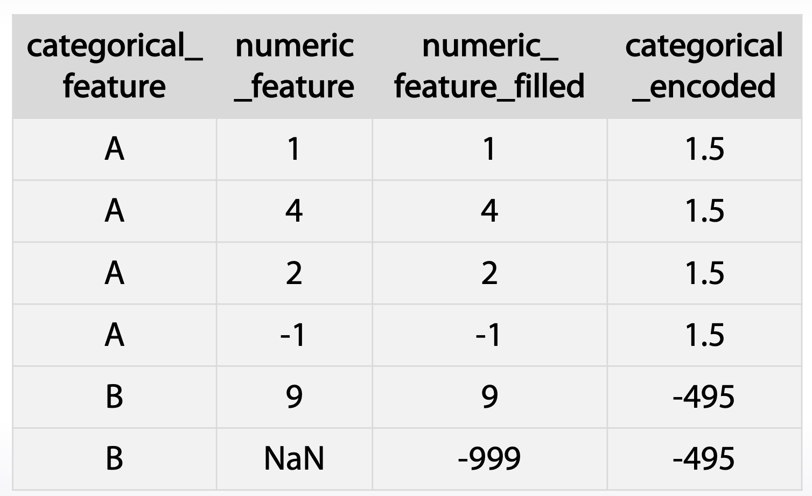

### Week1 - Feature preprocessing and generation with respect to models: Missing Values
- Coursera "How to Win a Data Science Competition: Learn from Top Kagglers" 강의 정리.
- Kaggle 문제 해결을 통한 Data Science 능력을 키워보자.
- https://www.coursera.org/learn/competitive-data-science

### 1. Overview

- Missing Values란?
  - not a number
  - very large numbers
  - \-1, -999, 999
  - empty string
  - etc...

### 2. Hidden NaNs

- 어떤 데이터가 missing value라는 것을 어떻게 알 수 있을까?
- 아래와 같은 데이터 예시에서 missing value가 있다고 가정할 경우, 연속균등분포(uniform distribution)을 통해 missing value가 \-1로 대치되었다고 가정할 수 있다.

- missing values는 위와 같이 특정 값들로 대치되어 드러나지 않고 숨어있을 수 있다. 

### 3. Fillna approaches

1. \-999, \-1, etc
   - nan을 특정 고정 값으로 대치한다.
   - 선형 데이터에는 적합하지 않다.
2. mean, median
   - nan을 평균이나 중간값으로 대치한다.
   - 선형 데이터나 신경망 모델에서 적합한 방법이다.
3. reconstruct value 
   - 데이터를 새로 구성하여 채워넣는다.

### 4. Missing Values Reconstruction

- 아래와 같은 시계열 데이터에선 missing value를 추정하여 채워넣을 수 있다.
- 그러나 이는 매우 드문 예로, 대부분의 경우엔 sample들은 서로 독립적이다.
- 즉, 대부분의 경우 reconstruction을 위한 정석적인 방법이 없다.

### 5. Feature Generation with Missing Values

- feature generation 전에 missing values를 대치할 경우 매우 조심해야 한다.
- 아래의 예시들을 살펴보자.

#### 5.1 Example1 : Replace nan with Median

- 1년간의 기온변화 데이터셋에서 nan을 median으로 치환할 경우, nan은 0으로 치환될 것이다.
- 이 경우, nan인 구간과 값이 있는 구간사이 큰 격차가 발생할 수 있다. -> model misleading

- 위 예에서 nan 구간에 대해 feature generation을 수행한다면 적절한 데이터가 생성되기 어렵다.

#### 5.2 Example2 : Replace nan with \-999

- categorical feature를 인코딩할 경우, 카테고리별 특정 feature 값들의 평균으로 채우는 방법이 있다.
- 아래 예시에서 numeric feature의 nan을 -999로 채울 경우, nan이 많은 카테코리일 수록 평균값이 -999에 가까워질 것이다.
- 이는 원래 의도한 feature들의 평균값과는 다른 값이 될 것이다. -> misleading
- mean, median으로 nan을 채우더라도 같은 효과가 발생할 것이다.

- 본 예시에서 적절하게 카테고리들을 인코딩하고 싶다면, nan 값인 경우를 무시하고 유효한 값들만으로 평균을 내야 할 것이다.

### Summary

1. fill NaN 방법은 상황에 따라 다르다.
2. 가장 일반적인 방법은 median, mean, \-999 로 치환하는 것이다.
3. missing values는 데이터 제공자에 의해 이미 특정 값으로 치환되어 있을 수 있다. (uniform distribution)
4. isnull과 같은 binary feature를 추가하는 방법이 효과적일 수 있다.
5. 일반적으로 feature generation 전에 fillna를 수행해선 안된다.
6. XGBoost는 NaN을 해결해준다.

### 연습문제

##### 1. What type does a feature with values: [‘low’, ‘middle’, ‘high’] most likely have?

- ordinal (ordered categorical)

##### 2. Suppose you have a dataset X, and a version of X where each feature has been standard scaled. For which model types training or testing quality can be much different depending on the choice of the dataset?

- Neural Network
    - There are two reasons for this: first, amount of regularization applied to a feature depends on the feature's scale. Second, optimization methods can perform differently depending on relative scale of features.
- Nearest Neighbours
    - The reason for it is that the scale of features impacts the distance between samples. Thus, with different scaling of the features nearest neighbors for a selected object can be very different.
- Linear Models
    - There are two reasons for this: first, amount of regularization applied to a feature depends on the feature's scale. Second, optimization methods can perform differently depending on relative scale of features.

##### 3. Suppose we want to fit a GBDT model to a data with a categorical feature. We need to somehow encode the feature. Which of the following statements are true?

- Depending on dataset either of label encoder or one-hot encoder could be better.

##### 4. What can be useful to do about missing values?

- Nothing, but use a model that can deal with them out of the box
    - Some models like XGBoost and CatBoost can deal with missing values out-of-box. These models have special methods to treat them and a model's quality can benefit from it.

- Reconstruct them
- Replace them with constant(\-999, \-1, etc)
- Impute with a feature mean
- Remove rows with missing values