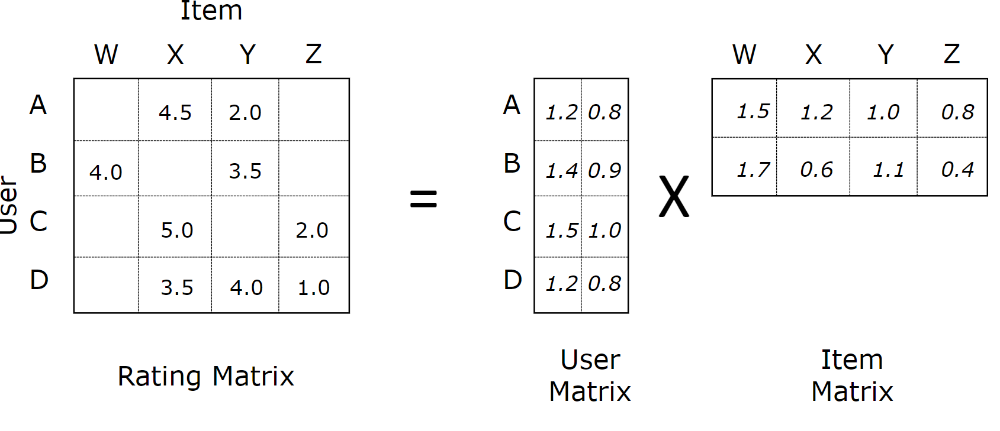
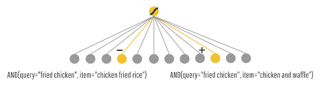

- 논문 “DeepFM: A Factorization-Machine based Neural Network for CTR Prediction”의 개념을 단계적으로 이해해보자
- PDF url : https://arxiv.org/pdf/1703.04247.pdf
- 순서
    1. Recommender System
    2. Matrix Factorization
    3. Factorization-Machine (FM)
    4. Factorization-supported Neural Network (FNN)
    5. Wide & Deep
    6. DeepFM

## 1. Recommender System

### 1.1 CTR (Click-Through Rate)

CTR(Click-Through Rate) 예측은 광고 문제에서 매우 중요하다. 추천 시스템에서는 eCPM를 계산하여 추천점수 기반으로 랭킹을 메겨야 하는데, eCPM 계산에서 pCTR (예측된 클릭률) 이 필요하다.

- eCPM = Bid Amount x Likeness
    - BA : 광고주가 원하는 행동에 대해 지불할 의사가 있는 금액
    - Likeness : 유저가 해당 행동을 하고 싶어하는 정도

이를 다시 쓰면 아래와 같다.

- eCPM = BA x pCTR
    - pCTR = number of clicks / number of impressions

### 1.2 Algorithms

추천 시스템에서 사용되는 알고리즘

- Factorization models (General) :
    - 추천 시스템에서 많이 사용하는 하나의 차원축소 방법
    - MF(Matrix Factorization), SVD++, …

- Factorization Machine (FM) :
    - 고차원 데이터에서도 제품 변수 간의 상호작용을 통해 효율적으로 사용할 수 있는 지도학습으로 회귀분석과 분류분석 모두에 사용 할 수 있다
    - 다항식 회귀 또는 커널 방법과 동등하지만, 더 작고 빠른 모델 평가를 통해 정확도를 얻을 수 있음

    
### 1.3 참조

- https://dos-tacos.github.io/paper%20review/FFM/
- https://brunch.co.kr/@kakao-it/84

------------------------

## 2. Matrix Factorization

> Matrix Factorization은 추천 시스템에서 사용되는 협업 필터링 알고리즘이다. User-Item 상호작용 행렬을 두 개의 낮은 차원의 직사각형 행렬의 곱으로 분해하여 작동한다. 이 방법은 Simonflik가 2006 년 블로그 게시물에서 연구 결과와 연구 결과를 공유 한 결과 그 효과 때문에 Netflix 상금 도전 중에 널리 알려졌다.
기본 개념은 낮은 차원의 잠재 공간에서 User-Item을 분리하여 나타내는 것이다. 2006년 Funk의 초기 작업 이후, 추천 시스템을 위해 다수의 행렬 분해 방법이 제안되었다. (Funk SVD, SVD++ 등)
위키백과

### 2.1 개요
우선 MF 모델은 user-item 의 matrix에서 이미 rating이 부여되어 있는 상황을 가정한다. (당연히 sparse한 matrix를 가정한다)  MF의 목적은, 바꿔 말하면 Matrix Complement 이다. <b>아직 평가를 내리지 않은 user-item의 빈 공간을 Model-based Learning으로 채워 넣는 것을 의미</b>한다.

유저간, 혹은 아이템간 유사도를 이용하는 Memory-based 방법과 달리, MF는 행렬 인수분해라는 수학적 방법으로 접근한다. 이는 행렬은 두개의 하위 행렬로 분해가 가능하며, 다시 곱해져서 원래 행렬과 동일한 크기의 단일 행렬이 될 수 있다는 성질에 기인한 것이다.

크기 U X M을 가지는 rating matrix R이 있다고 하자. 이 때 R은 각각의 크기가 U X K, M X K인 두 개의 행렬 P와 Q로 분해될 수 있다고 가정해본다. 그리고 다시 P X Q 행렬을 계산하면, 원래의 matrix R와 굉장히 유사하며 크기가 동일한 행렬이 생성된다. 중요한 것은, 행렬이 재생성 되면서 빈 공간이 채워진다는 것이다. 이러한 <b>행렬 인수 분해의 원칙은 비평가 항목을 채우기 위함</b>이라는 것을 알 수 있다. 

또한 한 가지 알 수 있는 것은, 분해된 행렬 P, Q는 각각 User-latent factor matrix, Item-latent factor matrix라는 각각의 내재적 의미를 나타내는 잠재 행렬도 나타낼 수 있다는 것이다. 이는 사람이 해석하는 잠재의미로도 해석은 가능하지만 기계가 해석하기 위한 행렬, 즉 블랙 박스 모델에 더 가깝다.

### 2.2 목적함수

이제 MF를 학습하는 것은 latent feature들을 학습하는 것과 같다는 것을 알게 되었다. Latent 행렬을 각각 P, Q라고 했을 때 이제 MF 모델의 목적함수는 다음과 같다.

이 목적함수를 최소화 하는 것이 P와 Q를 학습하기 위한 것이다. 결국 rating의 y-y^ 제곱을 오차로 활용하는 것이기 때문에, 일반적인 regression에서의 최적화와 마찬가지로 정규화 파라미터를 추가해준다.

### 2.3 ALS (Alternating Least Square)
교대 최소 제곱법, ALS는 위에서 정의한 목적함수를 최적화하는 기법이다. 일반적인 파라미터 최적화 기법으로 Gradient Descent를 사용하지만, 추천 알고리즘의 computation 환경인 분산처리 플랫폼에서는 GD보다 ALS가 더욱 효과적이라고 알려져 있다. 이는 ALS의 계산 방법 때문인데, <b>GD에서처럼 Loss에 대한 편미분값을 update gradient로 활용하는 것이 아닌, P와 Q 벡터 중 하나를 고정해놓고 교대로 계산</b>하기 때문이다. 이러한 방법은 분산처리 환경에서 더욱 빠른 연산이 가능해진다. 또한 ALS는 GD와 비교해볼때 sparse한 데이터에 robust한 모습을 보인다고 알려져 있다. Spark에서는 MF의 기본 학습법을 ALS에 기반하여 ML library로 제공하는데, Implicit feedback에 최적화된 학습까지 제공한다

### 2.4 참조
- https://yamalab.tistory.com/89

------------------------

## 3. Factorization-Machine (FM)

### 3.1 개요
<b>FM 모델은 개인화를 위해 머신러닝을 추천 영역의 기술로 개량한 것</b>이다. Matrix/Tensor Factorization 혹은 Polynomial regression과 같은 Generalization을 매우 잘 수행하는 알고리즘으로 입증되어 있다.

대부분의 추천 문제들은 (user, item, rating) 으로 이루어진 튜플셋을 데이터로 사용한다. 이 데이터들을 이용하여, CF의 다양한 방법들로 좋은 결과들을 도출할 수 있었다. 하지만 대부분의 real-world 에서는 (tags, categories, genres) 등과 같은 풍부한 메타데이터가 오히려 더 좋은 데이터셋으로 쓰인다. 그래서 이론적으로는 rating이 매겨진 튜플셋을 우선적으로 고려하지만, 실제 추천 시스템에서는 메타데이터를 고려하는 것이 더 중요하다. FM을 사용하면, 이러한 feature-rich 데이터셋을 사용하기에 좋다. 

### 3.2 Model Equation
먼저, degree d = 2인 Factorization Machine의 모델은 다음과 같이 정의된다. 다시 얘기하겠지만, degree가 2라는 것은 latent vector를 조합하는 후보의 수를 2개로 하겠다는 것이다.

(w는 바이어스, v는 latent vector, x는 입력 feature)

Matrix Factorization의 개념을 다시 한 번 복기해보자. User X Item을 index로 하여 rating으로 value가 채워진 Matrix R이 있다고 하자. 이를 두개의 latent vector로 분해하여 V1(u X k), V2(i X k) 로 나타낼 수 있다. 이 때 추정해야되는 변수는 global bias W0, V1 bias W_u, V2 bias W_i, latent vector W(혹은 V)이다. 이 때 k가 늘어날 수록 W의 변수가 많아지기 때문에, R^가 R에 근사할 수 있는 변수를 더 많이 계산하게 된다. 또한 W1, W2의 shape은 k가 1인 V1, V2와 동일한 shape을 가진다.

FM을 위해 다음과 같은 데이터 셋을 예시로 한다.

user와 item을 row, column index로 하는 데이터와는 구성이 약간 다르다. 위 데이터셋에서 User에 대한 sparse vector(one-hot encoding)을 x1, Item에 대한 vector를 x2, 그리고 추가적인 피처들을 x_n 이라 하자. 그리고 x1에 대한 latent vector를 V1, x_n에 대한 latent vector를 V_n이라고 할 것이다. MF와 마찬가지로, V의 row v_i는 i-th variable with k factor를 의미한다. 이제 다시 FM의 equation을 보면, 수식에 FM의 아이디어가 그대로 녹아있다는 것을 확인할 수 있다.

우선 y^(x)의 두번째 항을 살펴보자. MF에서는 W_u, W_i 를 구하는 반면, FM에서는 W_i X x_i를 구한다. MF에서의 두개 latent vector들의 각각의 row에 대한 고유한 bias가 FM에서도 마찬가지로 구해진 것이다. 달라진 것은 MF에서는 user, item으로 구성된 matrix의 index 마다 이를 구했지만, FM에서는 x_i 마다 이를 구한 것뿐이다.

다음으로 세번째 항을 보자. 수식이 의미하는 바는, MF에서 user latent X item latent 를 통해 rating을 계산해 주었던 것을, sum(x_i latent vector X x_i+1 latent vector)로 해주겠다는 것이다. 이 수식의 아이디어는, <b>변수간의 latent vector 조합을 전부 고려하여 rating을 도출</b>해내겠다는 것이다. 즉 Matrix Factorization 계열 알고리즘의 핵심 아이디어와, polynomial regression 계열 알고리즘의 핵심 아이디어를 결합했다고 볼 수 있다(Wide and Deep 알고리즘과 아이디어가 매우 유사하다. 차이점은 polynomial product를 자동으로 하는 FM이 더 간단하게 느껴진다는 것). 이렇게 함으로써 degree가 2인 FM은 <b>모든 두 변수간의 pairwise interaction을 잡아낸다</b>.

일반적으로 sparse한 환경에서는 피처간의 interaction이 매우 연관적이거나 독립적으로 나타나는 경향이 있다. 하지만 FM을 통해 interaction을 구하면 피처간의 독립성을 깨기 때문에 매우 잘 작동한다고 한다. 이 말에 대해 예시를 들어 이해해보자. 만약 A라는 유저가 X라는 영화를 평가한 적이 없다고 하자. Polynomial product 관점의 접근이라면, A는 X를 평가한 적이 없기 때문에 interaction은 0이 나올 것이다. 하지만 Factorization을 통해 interaction을 계산하게 되면, X에 대한 잠재적인 평가를 얻어낼 수 있는 것이다. 이는 MF 계열의 모든 알고리즘의 장점이라고 할 수 있다. 조금 더 modeling 친화적인 관점에서 보자면 <b>latent vector들의 interaction, 즉 dot product 과정은 cosine 함수와 같이 유사도를 구하는 개념이기 때문에 hidden feature간의 유사도를 평가한다고 할 수 있다</b>.

FM 모델은 가능한 모든 피처간의 interaction을 full-parametrized one 대신에 사용한다. 이를 통해 매우 희소한 데이터에서도 관계를 추정할 수 있다. 또한 SVD, SVM등의 알고리즘보다 속도나 성능 측면에서도 월등하게 좋은 알고리즘이다.

### 3.3 FM의 장점
- 신뢰할 수 있는 상호 작용 정보를 모델링 할 수 있다.
- 대규모의 sparse한 데이터를 처리 할 수 있다.

### 3.4 MF와의 비교

- MF는 행렬을 인수 분해하는 방법이다. 행렬을 두 개의 행렬로 분해하여 원래의 행렬과 정확하게 일치시키는 작업을 수행한다.
- FM은 선형 모델로 공식화되며 추가 매개 변수로서 Feature 간의 상호 작용이 있다. 
- Feature  상호 작용은 일반 형식 대신 Latent Vector 표현으로 수행된다. MF와 같은 Feature 상호 작용과 함께 다양한 Feature 의 선형 가중치도 사용한다.
- MF가 일반적으로 사용되는 권장 시스템에서는 side-features을 사용할 수 없다. 
    - 예를 들어 영화 추천 시스템의 경우 MF에서 영화 장르와 언어 등을 사용할 수 없다. 
- FM은 회귀 분석 및 이진 분류와 같은 다른 예측 작업에도 사용할 수 있다. MF은 그렇지 않다.

- MF가 User-Item간의 Rating만 계산했다면 FM은 모든 피처쌍의 pairwise interaction을 찾아 Rating을 도출한다.
    - MF와 달리 User, Item, Rating의 데이터 외 추가적인 메타데이터를 입력받을 수 있다. 즉 feature-rich 데이터 셋에 적합하다.

### 3.5 deepCTR 라이브러리의 FM
FM은 임베드 아이디어를 기반으로 한다. 즉, 각 카테고리 피처를 latent vector로 취급하고 해당 반복 정보를 latent vector의 inner product으로 모델링한다.

### 3.6 참조
- https://deepctr.readthedocs.io/en/latest/models/TraditionalModels.html#fm-factorization-machines
- https://yamalab.tistory.com/107

------------------------

## 4. Factorization-supported Neural Network

### 4.1 개요

FNN은 희소한 피처를 밀도 높은 latent vector로 임베딩한 뒤 DNN에 입력한다. 또한 저차원 및 고차원 피처 상호작용을 모델링한다.

네트워크 구조는 아래와 같다.

------------------------

## 5. Wide & Deep

### 5.1 개요

Google의 Wide & Deep 모델은 Deep Neural Network (일반화)와 함께 Wide Linear Model (암기용)을 함께 훈련함으로써 두 가지 장점을 결합한 것이다. 추천 시스템, 검색 및 순위 문제처럼 희소한 입력 (매우 광범위한 값들을 갖는 범주형 피처)의 일반적인 대규모 회귀 및 분류 문제에 유용하다.

### 5.2 동작 원리

FoodIO라는 가상의 음식 주문 앱을 예시로 들어보자. 앱 사용자는 자신이 원하는 음식의 종류 (질의)를 말한다. 앱은 사용자가 가장 좋아할 접시를 예측하고 접시를 사용자의 정문 (아이템)으로 전달한다. 주요 측정 항목은 소비율이다. 사용자가 접시를 먹은 경우 점수는 1, 그렇지 않으면 0 (라벨)이다.

불행히도, 매칭이 너무 조잡하여 소비율이 매우 낮다는 것을 알게 되었다. (“튀김 치킨”을 외치는 사람들은“닭 볶음밥”을 얻는 등) 따라서 데이터에서 배울 기계 학습을 추가하기로 결정했다 .

#### 5.2.1 Wide model

두 번째 버전에서는 각 쿼리에 가장 적합한 항목을 기억하고자 한다. 따라서 피처들의 벡터곱으로 만들어진 다양한 셋을 사용하여 TensorFlow에서 선형 모델을 학습한다. 이 모델은 쿼리-아이템 피처 쌍들의 공출현이 레이블과 어떤 영향을 주고받는지를 포착한다. (아이템이 판매되었는지와는 관계없이!)

이 모델이 각 품목에 대한 소비 확률 P(소비량 | 쿼리, 품목)를 예측하면 FoodIO는 예상 소비율이 가장 높은 최상위 품목을 제공한다.

예를 들어, 모델은 AND(query="fried chicken", item="chicken and waffles")은 소비율이 높은 반면, 문자열이 비슷하더라도 AND(query="fried chicken", item="chicken fried rice")는 소비율이 낮게 나온다고 학습하게 될 것이다.

다시 말해, FoodIO 2.0은 사용자가 좋아하는 것을 훌륭하게 "암기"하게 되는 것이다.

#### 5.2.2 Deep model

Wide 모델과 같이 선형적인 모델을 사용하면 늘 같은 항목을 추천하게 된다. 추천 시스템이 항상 똑같은 것을 추천하면 고객들은 금방 식상해하므로 새로운 것을 추천하기 위한 모델이 필요하다.

딥러닝을 사용할 경우, 질의와 항목에 대한 저차원 고밀도 표현(즉 임베딩 벡터)을 사용할 수 있다. 이렇게 하면 추천 시스템은 임베딩 공간에서 서로 가까운 쿼리의 항목끼리 매칭시켜 일반화(generalize) 할 수 있다. 예를 들어, "fried chicken"을 주문한 사람에게 "burgers"를 추천할 수 있게 되는 것이다.

#### 5.2.3 Combining Wide and Deep models

딥 모델은 때때로 과도하게 일반화된 추천을 하거나 전혀 관련 없는 항목을 추천하기도 한다. 여기서 트래픽을 조사하면 실제로 데이터에 두 가지 고유 한 유형의 쿼리-항목 관계가 있다는 것을 알 수 있다.

##### (1) 구체적인 쿼리
첫 번째 유형의 쿼리는 매우 구체적이다. "무지방 우유를 곁들인 아이스 카페인 라떼"와 같은 매우 특정한 품목을 외치는 사람들에겐 비슷한 제품이 아니라 실제로 그 품목을 제공해야 한다. 임베딩 공간에서 "전유를 곁들인 핫 라떼"에 아주 가깝다고해서 이것이 수용 가능한 대안이되는 것은 아니다. 

즉 임베딩의 전이성이 오히려 해가 되는 경우가 많을 수 있다.

##### (2) 포괄적인 쿼리
반면에 "해산물" 또는 "이탈리아 음식"과 같이보다 탐색적인 쿼리는 보다 일반화되고 다양한 관련 항목을 발견 할 수 있다.

이러한 두 가지 유형의 쿼리-항목 관계에 모두 대응하기 위해 Deep, Wide 모델을 모두 사용하는 것이 Wide & Deep의 기본 개념이다.

#### 5.2.4 Training

위는 combined된 Wide & Deep 모델을 나타낸 것이다. 학습하는 동안 예측 오차는 모델 파라미터를 훈련시키기 위해 양쪽으로 역전파된다.

Wide 모델의 피처곱 변환은 이러한 희소한 특정 규칙을 모두 암기 할 수있는 반면, Deep 모델은 임베딩을 통해 유사한 항목으로 일반화(generalize)할 수 있다.

### 5.3 정리

- Wide 모델(linear) :
    - 장점은 서로 관계가 없는 interaction은 확실히 0을 만들어 쓸데없는 관계로 인해 모델성능이 떨어질 일이 없다는 것이다.
    - 단점은 학습에 등장한 적이 없는 feature가 등장했을때는 아예 모델이 예측을 못하는 일이 발생하는 것이다.

- Deep 모델(embedding) :
    - 장점은 임베딩 공간에서 가까운 interaction을 찾는 일반화(generalize)가 가능하다는 점이다.
    - 단점은 임베딩으로 인해 0이 아닌 값들로 채워져 underfit으로 인해 지나치게 일반화되면 관련이 적은 interaction을 찾게될 수 있다는 점이다.

- Wide & Deep 모델 :
    - 위 두 모델을 결합하여 서로의 장단점을 보완한다.

### 5.4 deepCTR 라이브러리의 Wide & Deep 모델

### 5.5 참조
- https://ai.googleblog.com/2016/06/wide-deep-learning-better-together-with.html
- https://deepctr.readthedocs.io/en/latest/models/DeepModels.html#id6
- http://www.kwangsiklee.com/2018/03/%ED%8A%9C%ED%86%A0%EB%A6%AC%EC%96%BC-%EC%A0%95%EB%A6%AC-wide-deep-learning-%EB%AA%A8%EB%8D%B8/

------------------------

## 6. DeepFM

